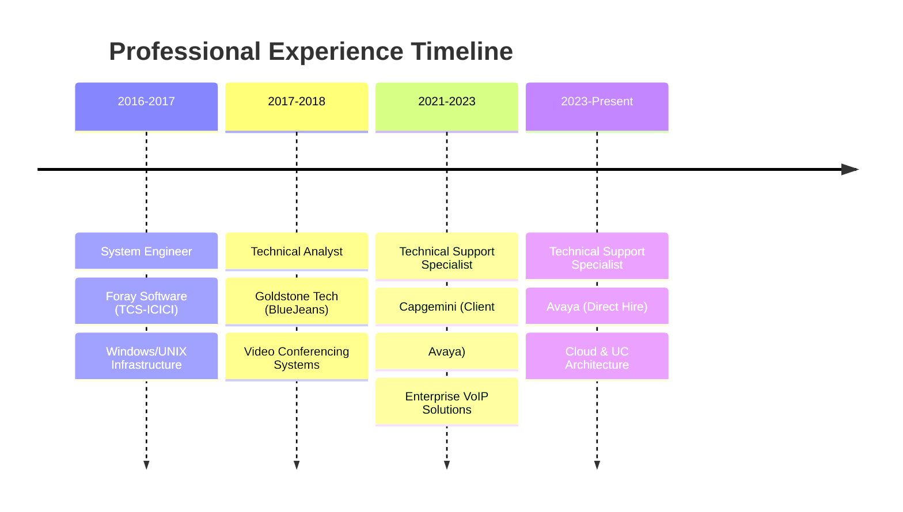

<div align="center">

# 🚀 Mohammed Abdullah

### *Crafting Enterprise Cloud Solutions & VoIP Architectures*


[](https://linkedin.com/in/mohammed-abdullah--cloudengineer)
[](mailto:mohammed.abdullah700@gmail.com)
[](https://www.credly.com/users/abdullah-cert)


</div>

## 🎯 About Me


```typescript
const mohammed = {
    role: "Technical Support Specialist @ Avaya",
    experience: "6+ years",
    specializations: [
        "Enterprise VoIP & UC Solutions",
        "Cloud Infrastructure (AWS/Azure)",
        "Network Security & Automation",
        "Infrastructure as Code"
    ],
    currentFocus: "Cloud Computing & DevOps @ IIT Roorkee",
    achievements: [
        "Contractor → Direct Hire @ Avaya",
        "Zero-downtime enterprise migrations",
        "10,000+ participant event support"
    ]
};
```

<br clear="both"/>

---

## 🏆 Featured Projects

<table>
<tr>
<td width="50%">

### 🌩️ **AWS Infrastructure Automation**

[](link-to-repo)
[](link-to-repo)

**Enterprise-grade AWS infrastructure deployment with Terraform**

🔹 **Multi-environment setup** (Dev/Staging/Prod)  
🔹 **Auto-scaling VPC architecture**  
🔹 **Security groups & IAM policies**  
🔹 **RDS with automated backups**  
🔹 **CloudWatch monitoring & alerts**  

```bash
# Quick deployment
terraform init
terraform plan -var-file="prod.tfvars"
terraform apply
```

**[📁 View Repository →](link-to-your-aws-repo)**

</td>
<td width="50%">

### 📦 **Packer Golden Images**

[](link-to-repo)
[](link-to-repo)

**Automated AMI creation pipeline for enterprise workloads**

🔹 **Multi-OS support** (Ubuntu/CentOS/Windows)  
🔹 **Security hardening built-in**  
🔹 **Automated patching & updates**  
🔹 **Docker & K8s ready images**  
🔹 **CI/CD pipeline integration**  

```json
{
  "builders": [{
    "type": "amazon-ebs",
    "source_ami_filter": "ubuntu-20.04-*"
  }]
}
```

**[📁 View Repository →](link-to-your-packer-repo)**

</td>
</tr>
</table>

---

## 🛠️ Technology Arsenal

<div align="center">

### ☁️ **Cloud Platforms**


### 🏗️ **Infrastructure as Code**


### 🐳 **DevOps & Containers**


### 💻 **Programming & Scripting**


### 🌐 **Networking & VoIP**


</div>

---

## 🏅 Certifications & Achievements

<div align="center">

<table>
<tr>
<td align="center" width="25%">

<br><strong>AWS Cloud</strong>
<br><sub>Practitioner</sub>
</td>
<td align="center" width="25%">

<br><strong>Azure Admin</strong>
<br><sub>AZ-104</sub>
</td>
<td align="center" width="25%">

<br><strong>CCNA</strong>
<br><sub>CSCO1309767</sub>
</td>
<td align="center" width="25%">

<br><strong>Python</strong>
<br><sub>PCEP Certified</sub>
</td>
</tr>
</table>

**[🏆 View All Certifications →](https://www.credly.com/users/abdullah-cert)**

</div>

---

## 💼 Professional Journey

<div align="center">



</div>

### 🎯 **Current Role @ Avaya** *| Technical Support Specialist*

<details>
<summary>🔍 <strong>Key Achievements & Responsibilities</strong> (Click to expand)</summary>

#### 🚀 **Major Accomplishments**

- 🏆 **Promoted from contractor to direct hire** based on exceptional performance
- 🌩️ **Led zero-downtime migrations** of critical enterprise systems
- 🔧 **Integrated Microsoft Teams Direct Routing** with Avaya Aura infrastructure
- 🛡️ **Implemented enterprise security protocols** (SRTP, TLS, SSL)
- 📊 **Managed 24/7 support** for global enterprise clients

#### 🔧 **Technical Expertise Applied**

```yaml
Cloud Deployments:
  - Azure: Multi-region Avaya Aura deployments
  - AWS: Scalable UC infrastructure
  - VMware: Virtualized telephony systems

Integration Projects:
  - Microsoft Teams Direct Routing
  - LDAP authentication systems
  - SIP trunk configurations
  - PSTN gateway integrations

Automation & Monitoring:
  - Network diagnostic automation
  - Performance monitoring dashboards
  - Incident response workflows
```

#### 📈 **Impact Metrics**

- ⚡ **99.9% uptime** maintained across managed systems
- 🎯 **<2 hour** average resolution time for critical issues
- 📚 **50+ KB articles** authored for technical documentation
- 🌍 **Global support** for 100+ enterprise clients

</details>

---

## 📊 GitHub Analytics

<div align="center">


</div>

<div align="center">


</div>

---

## 🗂️ Repository Portfolio

<div align="center">

| 🌩️ **Cloud Infrastructure**                                                                                                                                                                                      | 📦 **Automation & IaC**                                                                                                                                                                      | 🌐 **Networking & VoIP**                                                                                                                                                                             |
|:-----------------------------------------------------------------------------------------------------------------------------------------------------------------------------------------------------------------:|:--------------------------------------------------------------------------------------------------------------------------------------------------------------------------------------------:|:----------------------------------------------------------------------------------------------------------------------------------------------------------------------------------------------------:|
| [](https://github.com/Ab-Cloud-dev/aws-terraform-infrastructure) | [](https://github.com/Ab-Cloud-dev/packer-golden-images) | [](https://github.com/Ab-Cloud-dev/avaya-automation-scripts) |

</div>

---

## 🎓 Continuous Learning


### 📚 **Currently Pursuing**

**Post Graduate Diploma in Cloud Computing & DevOps**  
🏛️ **IIT Roorkee** | *2024-2025*

**Focus Areas:**

- Advanced AWS & Azure architectures
- Kubernetes orchestration
- CI/CD pipeline optimization
- Infrastructure monitoring & observability

### 🎯 **Next Learning Goals**

- [ ] AWS Solutions Architect Professional
- [ ] Certified Kubernetes Administrator (CKA)
- [ ] HashiCorp Terraform Associate
- [ ] Advanced Python for DevOps

<br clear="both"/>

---

## 🌟 Featured Blog Posts & Tutorials

<table>
<tr>
<td width="50%">

### 📝 **"Zero-Downtime Avaya Migration Strategies"**

*Best practices for enterprise VoIP system migrations*

🔹 Pre-migration planning checklist  
🔹 Rollback strategies & risk mitigation  
🔹 Testing methodologies  
🔹 Real-world case studies  

**[📖 Read More →](link-to-blog)**

</td>
<td width="50%">

### 📝 **"AWS Cost Optimization with Terraform"**

*Automated resource management for enterprise workloads*

🔹 Right-sizing strategies  
🔹 Reserved instance automation  
🔹 Cost monitoring alerts  
🔹 Multi-account governance  

**[📖 Read More →](link-to-blog)**

</td>
</tr>
</table>

---

## 🤝 Let's Collaborate!

<div align="center">


### 🚀 **Open to exciting opportunities in:**

🌩️ **Cloud Architecture & Migration Projects**  
📞 **Enterprise VoIP & UC Solutions**  
🔧 **DevOps & Infrastructure Automation**  
🛡️ **Network Security & Compliance**  

<br>

[](https://linkedin.com/in/mohammed-abdullah--cloudengineer)
[](mailto:mohammed.abdullah700@gmail.com)

<br>

**⭐ Star my repositories if you find them helpful!**  
**🤝 Open to collaboration and mentoring opportunities**


</div>
